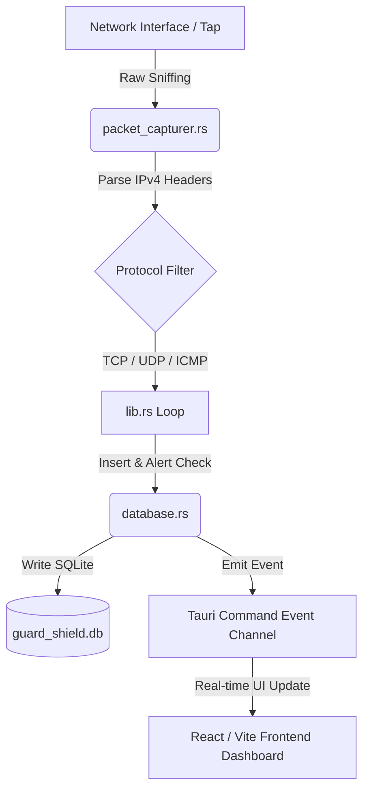

# GuardShield: AI Developer Instructions & Context

Welcome, AI Coding Assistant! This document provides the high-level context, system architecture, repository structure, and flexible design guidelines for the GuardShield project. Use this file as your blueprint to understand the codebase and build production-ready enhancements.

---

## 1. System Mission & Overview

GuardShield is a modern, high-performance hybrid Intrusion Detection System (IDS) and Intrusion Prevention System (IPS). It captures network traffic at the packet level, processes packet headers, evaluates them against signature rules, logs alerts to a local SQLite database, and presents real-time telemetries on a beautiful desktop UI.

Additionally, GuardShield includes a machine learning model (`CNN-LSTM`) trained to detect anomalous network flow behaviors, laying the foundation for zero-day threat detection.



---

## 2. Technical Stack & Dependencies

- **Desktop Framework**: Tauri v2 (enables lightweight Rust backends and web frontends).
- **Frontend**: Vite + React + TypeScript + Vanilla CSS/Tailwind (sleek, high-fidelity dark mode dashboards).
- **Backend Sniffing**: Rust (`socket2` raw sockets for Windows platform sniffing).
- **Database**: SQLite (`rusqlite` bundled) for localized packet buffering and alert archives.
- **Machine Learning**: TensorFlow/Keras (`.h5` model format) for a CNN-LSTM network flow classifier.

---

## 3. Directory Layout

```
f:/guard-shield/
├── core/
│   ├── apps/
│   │   └── guard-shield-tauri/
│   │       ├── src/                # React/TypeScript Frontend UI code
│   │       └── src-tauri/
│   │           ├── Cargo.toml      # Tauri dependencies (rusqlite, socket2, serde_json)
│   │           └── src/
│   │               ├── main.rs     # Application entrypoint
│   │               ├── lib.rs      # Tauri command handlers & thread dispatching
│   │               ├── packet_capturer.rs # Raw socket sniffer (SIO_RCVALL)
│   │               └── database.rs  # SQLite connection, inserts, and rules validation
│   ├── packages/
│   │   ├── eslint-config/          # Shared ESLint configuration
│   │   ├── typescript-config/      # Shared TS compiler configurations
│   │   └── ui/                     # Shared UI components UI stub
│   ├── package.json
│   ├── pnpm-workspace.yaml         # PNPM monorepo workspace configuration
│   └── turbo.json                  # Turborepo task pipeline config
├── model/
│   ├── GuardShield_CNNLSTM_v1.h5   # Trained CNN-LSTM deep learning model weights
│   └── GuardShield_CNNLSTM_v1.ipynb # Model architecture, training pipeline, and validation notebook
└── npcap-sdk/                      # Packet Capture SDK headers & libs
```

---

## 4. Key Core Backend Modules

- **[packet_capturer.rs](file:///f:/guard-shield/core/apps/guard-shield-tauri/src-tauri/src/packet_capturer.rs)**:
  - Binds to chosen local interface IPv4 address.
  - Configures raw WinSock socket via `WSAIoctl` using the `SIO_RCVALL` directive (requiring administrator/root privileges).
  - Sniffs and parses IPv4 header flags, protocols (TCP=6, UDP=17, ICMP=1), source/destination IPs, TTL, TCP flags, and UDP/TCP ports.
  - Sends parsed `PacketData` structures downstream via `crossbeam_channel::Sender`.

- **[database.rs](file:///f:/guard-shield/core/apps/guard-shield-tauri/src-tauri/src/database.rs)**:
  - Establishes and manages SQLite DB connection.
  - Manages database schemas (`packets` and `alerts` tables).
  - Handles batch insertions. Performs automatic log truncation (retains last 10,000 packets to keep disk footprint small).
  - Houses the signature/rules evaluation engine. Currently checks packets for matches and returns `AlertData` when matched.

- **[lib.rs](file:///f:/guard-shield/core/apps/guard-shield-tauri/src-tauri/src/lib.rs)**:
  - Exposes Tauri commands for frontend invoking: `get_network_interfaces`, `start_packet_capture`, `get_historical_packets`, `get_alerts`, and `get_telemetry_stats`.
  - Spawns the async runtime worker that receives captured packet streams, processes them through the database rules engine, and emits real-time event updates to the React UI via `app_clone.emit`.

---

## 5. Database Schema Details

SQLite tables are defined as follows:

```sql
CREATE TABLE IF NOT EXISTS packets (
    id INTEGER PRIMARY KEY AUTOINCREMENT,
    frame_time TEXT,
    frame_len TEXT,
    ip_src TEXT,
    ip_dst TEXT,
    ip_proto TEXT,
    ip_ttl TEXT,
    tcp_srcport TEXT,
    tcp_dstport TEXT,
    tcp_flags TEXT,
    udp_srcport TEXT,
    udp_dstport TEXT,
    ws_col_info TEXT,
    eth_src TEXT,
    eth_dst TEXT
);

CREATE TABLE IF NOT EXISTS alerts (
    id INTEGER PRIMARY KEY AUTOINCREMENT,
    timestamp TEXT,
    impact_score REAL,
    severity TEXT,
    port TEXT,
    protocol TEXT,
    info TEXT
);
```

---

## 6. Signature-Based Rules Format

Rules are stored in a structured JSON schema (`rules.json`). The detection engine parses this JSON file and applies matches on packet properties:
- **Header Matching**: Protocol, Source/Destination Ports, TTL values, IP addresses, TCP flag signatures (e.g., matching NULL scans or Xmas scans).
- **Frequency/Thresholding**: Alerts are grouped and rated according to risk impact scores.

---

## 7. Machine Learning Model Context

- **File**: `model/GuardShield_CNNLSTM_v1.h5`
- **Type**: CNN-LSTM hybrid architecture.
- **Workflow**: 
  - CNN layers extract spatial features from network packet sequences (packet sizes, intervals, flags).
  - LSTM layers capture temporal dependency / sequence behaviors (patterns across successive network flows).
  - In a production rollout, a sidecar service or an inline inference client (e.g., using `tract` or `onnxruntime` in Rust) executes predictions against captured flow windows, triggering alerts when the anomaly probability exceeds a threshold (e.g., `> 0.85`).

---

## 8. AI Guidelines for Development (Informed & Flexible)

When coding on this repository, prioritize **professionalism, readability, and performance** without feeling constrained by rigid scripts. Keep these principles in mind:

- **Empowerment over Rigidity**: You are encouraged to propose optimizations, suggest cleaner patterns, and adjust boundaries as long as it respects the core architecture. Do not restrict your problem-solving approaches arbitrarily.
- **Safe Resource Management**: When sniffing packets or inserting database records, ensure that operations are non-blocking. Use channels (like `crossbeam_channel`) and async task spawning to isolate network IO from the UI thread.
- **Robust Error Handling**: Avoid panics (`unwrap()`, `expect()`) in production-ready pathways. Elevate errors gracefully using Rust's `Result` patterns so the desktop UI remains responsive even if packet sniffing permissions fail.
- **Documentation Integrity**: Maintain existing comments and docstrings. Document non-obvious code paths (e.g., manual byte manipulations in raw packet parsing).
- **Aesthetic Excellence**: When editing the React frontend dashboard, ensure designs are polished, modern, responsive, and utilize cohesive dark mode themes with smooth interactive micro-animations.
