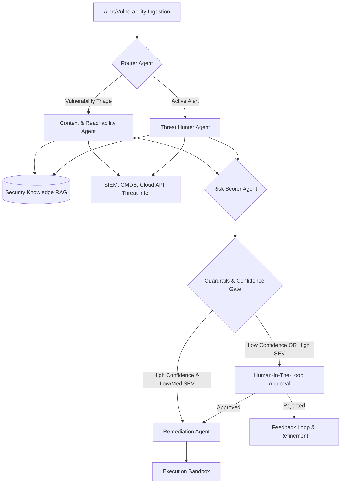

# Agentic Security Orchestration (AI Layer) Architecture

This document describes the recommended AI Layer architecture for automated security triage, vulnerability evaluation, and incident response. This architecture is designed to transform static alert logging into an autonomous, stateful, and safe reasoning pipeline.

---

## 1. Architectural Overview
A production-ready security AI layer must transition from a single monolithic LLM prompt to a **stateful multi-agent system**. Because security investigation is iterative (requiring loops, follow-up queries, and verification), the architecture is modeled as a **Stateful Directed Acyclic Graph (DAG) with cyclic support**.

---

## 2. Core Components of the AI Layer

### A. The Orchestration Engine (LangGraph)
*   **Why LangGraph?** Traditional sequential DAGs (like LangChain chains) cannot handle the loops required for deep triage (e.g., checking a log $\rightarrow$ finding an IP $\rightarrow$ looking up threat intel for that IP $\rightarrow$ checking firewall rules $\rightarrow$ re-evaluating the log). LangGraph supports cycles, state management, and built-in **Human-in-the-Loop** interrupts.
*   **State Persistence**: The system state (e.g., active indicators, current threat rating, evidence gathered) is persisted in a database (PostgreSQL/Redis), allowing agents to pause and wait for human input or asynchronous task completion without losing state.

### B. Specialized Agents & Tool Registries
Rather than giving one LLM access to all tools, assign scoped toolkits to specialized agent nodes:

1.  **Ingestion & Routing Agent**:
    *   *Inputs*: Raw logs, CVE alerts, SIEM webhooks.
    *   *Task*: Classifies target event type, extracts crucial entities (IPs, Hostnames, CVE IDs), and routes to the appropriate workflow path.
2.  **Context & Reachability Agent**:
    *   *Tools*: Asset Management DB (CMDB) API, Network Topology analyzer, Cloud IAM queries.
    *   *Task*: Answers the critical question: *"Is this asset exposed and vulnerable?"*
3.  **Threat Hunter Agent (For Alerts)**:
    *   *Tools*: SIEM logs (Splunk/Elastic), EDR telemetry (CrowdStrike/Defender), Threat Intel (VirusTotal, GreyNoise).
    *   *Task*: Evaluates behavior, correlates historical logs, and maps attack strings to the MITRE ATT&CK framework.
4.  **Risk Scorer Agent**:
    *   *Tools*: CVSS Calculator, EPSS lookup API.
    *   *Task*: Combines threat data and asset context to output a final, adjusted qualitative severity rating.
5.  **Remediation Agent**:
    *   *Tools*: Code repair agents (for application vulns), WAF rule generators, Terraform/Ansible config tools.
    *   *Task*: Generates concrete mitigation code, patches, or configurations.

---

## 3. Context & Knowledge Management (RAG)
To prevent hallucinations and provide company-specific context, the AI Layer relies on a hybrid Retrieval-Augmented Generation (RAG) pipeline:
*   **Vector Database (e.g., Qdrant / pgvector)**: Stores vectorized internal playbooks, system architecture documentation, past incident reports, and compliance requirements.
*   **Metadata Filtering**: Retrieve context based on specific tags (e.g., filter playbooks tagged with `#AWS` and `#EKS` when triaging a Kubernetes container escape alert).

---

## 4. Safety, Guardrails & Alignment

Because security agents interact with live environments, a multi-tiered safety model is required:

### A. Input Shielding (Prompt Injection Defense)
*   Deploy a lightweight classifier (e.g., **LlamaGuard** or **NeMo Guardrails**) at the entry point of the ingestion agent. This prevents attackers from executing prompt injection attacks via malicious payloads inside security logs or CVE descriptions.

### B. Output Sanitization (Code Validation)
*   Any shell commands, WAF rules, or code patches generated by the **Remediation Agent** must be parsed and verified. Prohibit destructive commands (e.g., `rm -rf`, raw database deletions) through system-level regex/parser constraints.

### C. Execution Sandbox
*   Before applying any remediation, run validation checks in an isolated environment (e.g., AWS Lambda, Firecracker microVMs, or localized Docker sandboxes).

### D. Human-in-the-Loop (HITL) Policy Matrix
The orchestration engine should dynamically block autonomous execution using this state matrix:

| Severity Level | Confidence Score | Action | Approval Required? |
| :--- | :--- | :--- | :--- |
| **SEV-1 (Critical)** | Any Score | Propose Containment Only | **Yes (Always)** |
| **SEV-2 (High)** | $< 0.90$ | Propose containment / Gather data | **Yes** |
| **SEV-2 (High)** | $\ge 0.90$ | Propose containment / Gather data | **Yes** (unless pre-approved policy) |
| **SEV-3 (Medium)** | $< 0.85$ | Create ticket | **No (Triage only)** |
| **SEV-3 (Medium)** | $\ge 0.85$ | Auto-mitigate (e.g., WAF block IP) | **No** |
| **SEV-4 (Low)** | Any Score | Log & Auto-Resolve | **No** |

---

## 5. Recommended Technical Stack Solution

| Layer | Technology | Rationale |
| :--- | :--- | :--- |
| **Agent Orchestration** | **LangGraph** (Python/JS) | Native support for cyclic logic, stateful persistence, and human-in-the-loop gates. |
| **Vector Database** | **Qdrant** or **pgvector** | Extremely fast metadata-filtered vector searches; pgvector integrates natively with existing relational databases. |
| **Primary LLM** | **Claude 3.5 Sonnet / GPT-4o** | Unmatched tool-use/function-calling capability, strong reasoning, and strict schema formatting. |
| **Local LLM (Air-gapped)** | **Llama 3 (70B) / Mixtral 8x22B** | Required for organizations with strict data compliance policies that prohibit cloud LLM usage. |
| **Guardrails** | **LlamaGuard 3** | Specifically trained to detect security risks, jailbreaks, and injection attempts in text. |
| **State Tracking** | **Temporal.io** or **Celery** | Manages asynchronous workflow states, retries, and long-running security tasks reliably. |
